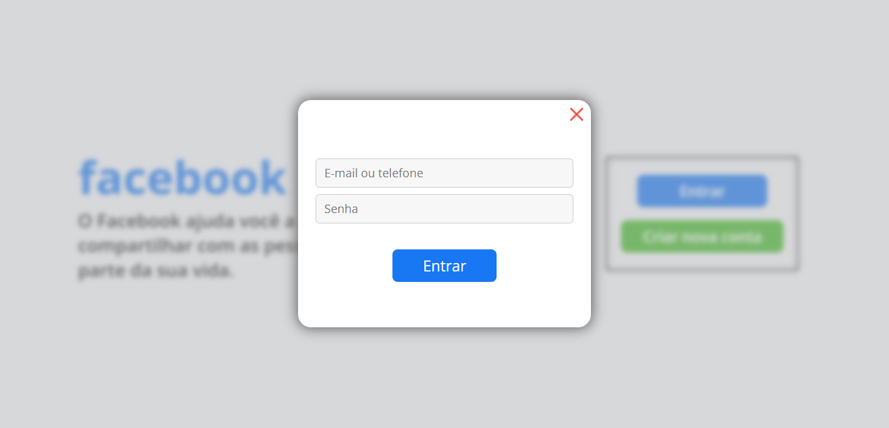
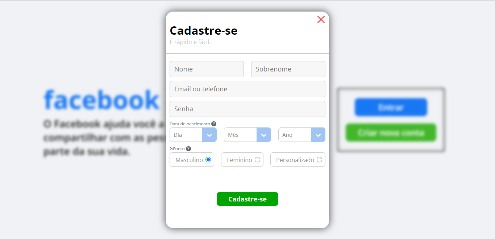
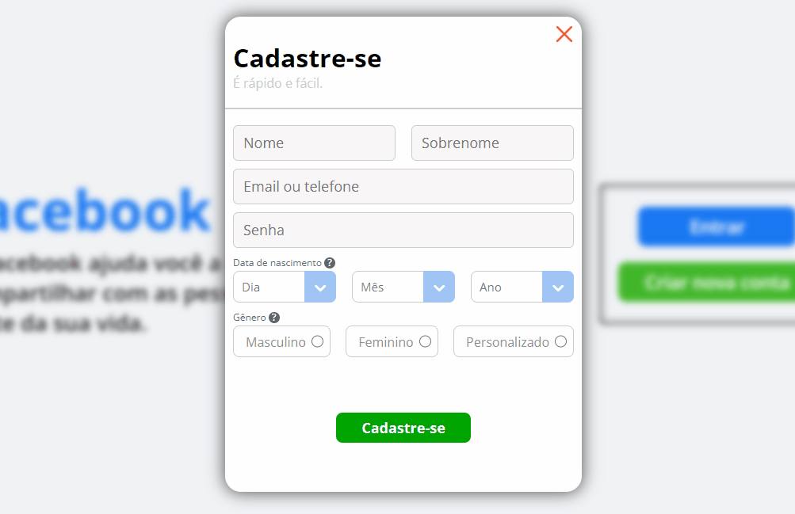

# Tela de login do Facebook

Projeto onde recriei tela de login do facebook, mas com algumas alterações.

Tive como objetivo nesse projeto testar meus conhecimento em JavaScript para a implementação de eventos e também validação de dados utilizando uma boa lógica e o Regex (Expressões regulares) para o cadastro do usuário.

<a href="https://joaoparaujocr.github.io/facebook-login-clone/">Link para visualizar o projeto</a>

# Imagens e Gif's

    <h4>Telas de login e cadastro</h4>
    
    
    

#
<h4>Validação dos dados</h4>

# Tecnologia

